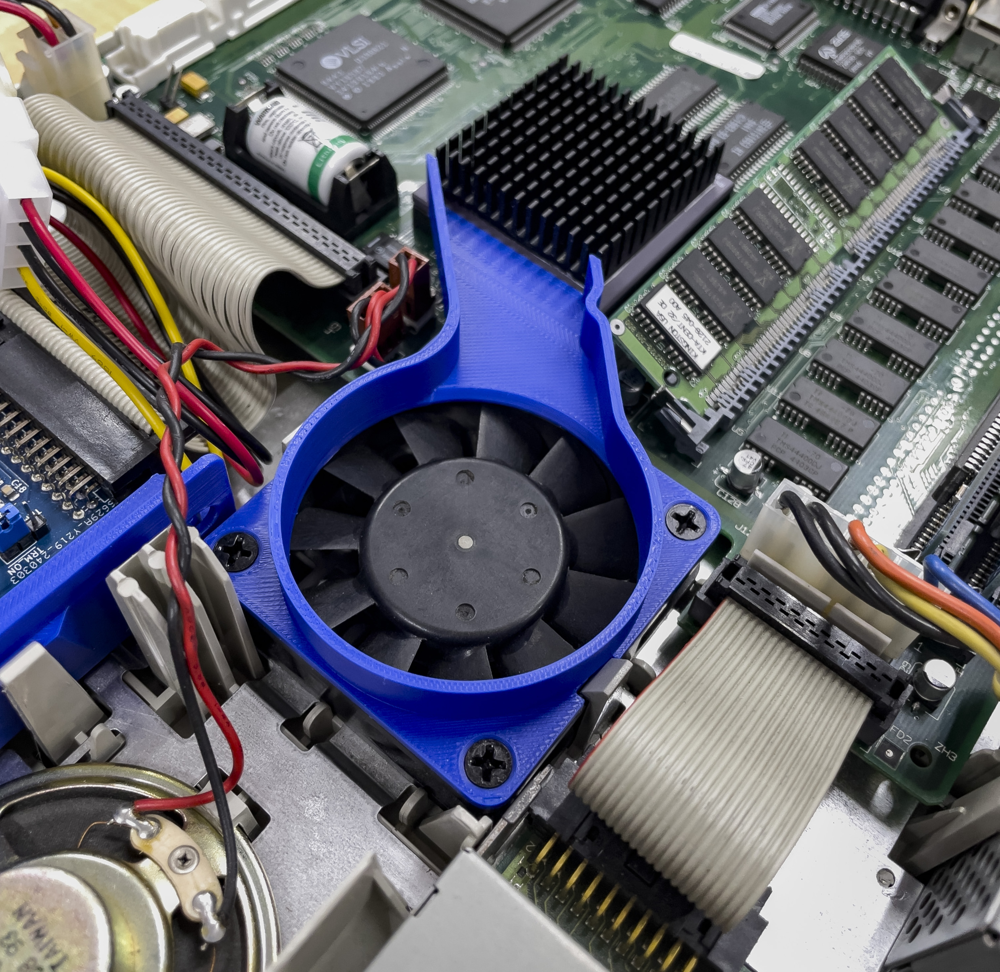

[clockchip GitHub Repositories](https://github.com/clockchip?tab=repositories)

# 3D-Printable Cooling Fan Extension for Apple LC475

This is a 3D-printable fan extension designed to be mounted on top of the 60mm x 60mm x 10mm case fan of an Apple LC475 computer. 
The extension improves airflow by efficiently directing hot air away from the CPU cooler mounted on the built-in Motorola 68040 processor. 
This enhances cooling performance and system stability.

This modification is highly recommended to maintain optimal temperatures under high-performance conditions, especially if you overclock your LC475 to 33 MHz or 40 MHz.
The solution is split into two separate parts: the bottom part, which will be mounted with three screws on top of the original fan, and the top lid.

## Printing Notes

The bottom section should be printed with supports due to the presence of small notches that require additional structural backing.

The top lid can be printed without any support structures; however, the Z-axis must be rotated 180 degrees to ensure a smooth interior finish. 
This adjustment optimizes airflow and prevents dust from adhering to the inside surface.

Additionally, I recommend using heat-resistant filaments for printing these parts.

## Pictures

## License

<a property="dct:title"  rel="cc:attributionURL"  href="https://github.com/clockchip/LC475-CoolingFanExtender">LC475-CoolingFanExtender</a> by clockchip is licensed  under <a  href="http://creativecommons.org/licenses/by-nc-sa/4.0/?ref=chooser-v1"  target="_blank" rel="license noopener noreferrer"  style="display:inline-block;">CC BY-NC-SA 4.0</a>
  
